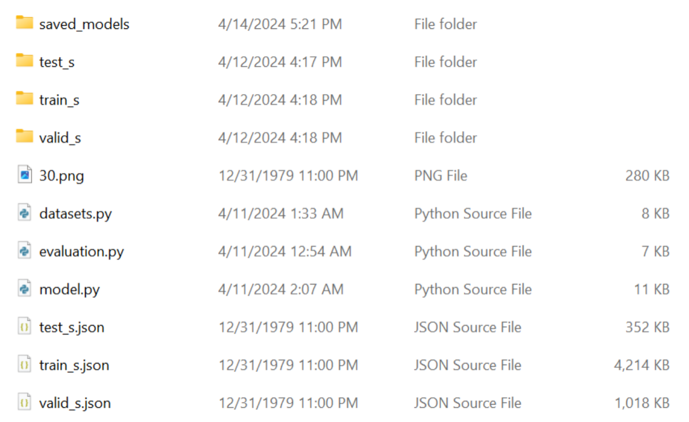

# Project Documentation

## Description
This project includes a Python model for image classification. It can currently identify 5 classes and is not currently configured to recognize airplanes, although it can be trained with other datasets that include airplanes.

## Requirements
- PyTorch
- CUDA(training only)
- Numpy

## Setup and Training
To set up and train the model, follow these steps:

1. **Installation**:
   Ensure that PyTorch, CUDA, and Numpy are installed in your environment.

2. **Training the Model**:
   Run the following command:
   python3 model.py
   

You can change the dataset path in the script to train on different datasets.

## Evaluation
To evaluate the model, you need to provide an image file (e.g., '30.png').
Run the following command:
   python3 model.py "name of a photo".png

## Configuration Options
- **Model Adjustments**: If you need a yes/no output, uncomment the relevant sections and adjust the `main` function accordingly.
- **Image Specifications**: Use images with the size of (500-300) x (500-300) pixels, in PNG format with true color and alpha.
