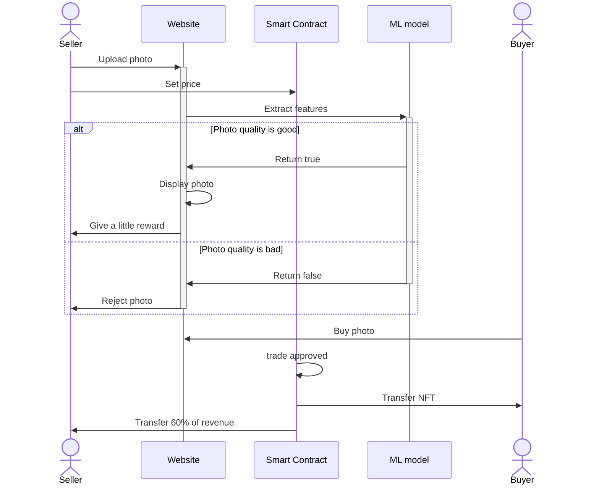

# S24_The_World_NFT


## Installation
### Website
```bash
npm run dev
```

### Smart Contract
### AI

## What is The World NFT

The World NFT, aims to provide everyone with the opportunity to become a photographer and allow users worldwide to explore, purchase and use their favorite image as an NFT to own it. At the core of the platform is the use of advanced artificial intelligence technology, as well as blockchain-based smart contracts, to ensure that interactions and value exchanges between photographers and buyers are both efficient and secure. More than a simple online photo marketplace, the project represents a new, decentralized art exchange and business model.

If you are willing to upload your photography work, you will receive a modest token of appreciation as a reward. We believe that heartfelt photographic works will surely be discovered by those who love the world! We encourage everyone to join our community!
## Why we need The World NFT
The World is here because every photoshot has a story eager for an audience. We want to give every aspiring photographer a chance to shine and every art lover a place to find that perfect image that speaks to them. By turning photos into NFTs, we're not just trading pictures; we're sharing pieces of the world. And with every photo uploaded, a token of thanks is given, encouraging more stories to be told. This is about making sure no view of the world goes unseen, and every creator feels valued. Let's make the art of photography accessible to all and celebrate the world through our lenses. Join in and let's create a gallery without walls together!
## Group Members:
### Kaiyang Chang (2281469043)
- Role: Write smart contracts primarily designed for facilitating transactions between buyers and photographers for the purchase of photographs, and capable of connecting with an oracle to transmit the photographs to an AI model.

### Yixuan Shen (Yixuan-Shen) | Hanzhen Qin (RyanLIL-XwX)
- Role: Developing a website and researching how to enable direct interaction between our website, "The World," and smart contracts. Aim to seamlessly integrate the functionality of smart contracts into our website, allowing them to run directly on the platform.

### Joe Wang (wangy78)
- Role: Focused on the AI part, using CNN and other classifiers to determine if the object matches what it claims to be and also determine the quality of the picture.
  
## Main sections in our project:
### Blockchain
- The blockchain architecture provides a decentralized platform for photographers to tokenize their work as NFTs. Sellers upload their photos along with descriptions and wallet addresses. The platform employs a machine learning model to verify that the images meet quality and description standards, ensuring authenticity. Approved photos are tokenized through a smart contract, rewarding the seller and listing the NFT for sale. Buyers can then purchase NFTs with transparency, as transactions are securely facilitated and recorded on the blockchain. Upon sale, revenue is distributed, with a percentage going to the seller.
### Smart Contract
[Smart Contract README](smart_contract/README.md)
- Smart contract is needed: **Platform Contract** facilitates transactions by transferring image links and prices between photographers and buyers. What's more, it can send token and recieve token to or from seller and buyer wallet addresses. Additionally, it ensures transparency and efficiency by verifying photo quality and returning revenue to the seller accordingly.
### The world website
[The World Website README](frontend/the-world/README.md)
- Introducing a revolutionary online platform tailored for seamless transactions between photographers and buyers, integrating effortlessly with buyers' Metamask accounts. Our innovative system incorporates advanced AI technology to streamline the process, automatically extracting photo links and conducting evaluations in real-time. Through this streamlined interface, buyers can swiftly identify and purchase high-quality images that meet their specific needs. Additionally, the platform receives feedback from the AI model to ensure that selected photos meet the buyer's criteria in terms of quality and suitability for their intended use.
### AI or Machine learning model
[AI README](AI/README.md)
- **Preparing data**:
Prepare a dataset comprising images paired with clear descriptions or labels. Preprocess the images for algorithm input by resizing, normalization, and applying data augmentation for enhanced diversity. Extract pertinent features from both images and descriptions: leverage Convolutional Neural Networks (CNNs) to extract high-level image features, while employing natural language processing (NLP) techniques to extract textual features.
- **Implementation**:
For classification tasks, start with logistic regression or decision trees for simplicity. Transition to KNN for more complexity. For advanced tasks, utilize PyTorch to implement a neural network with CNN layers for image classification. Split data into train, validation, and test sets. Employ cross-entropy loss and Adam optimizer for training. Evaluate models individually and ensemble results using techniques like voting or averaging. Assess performance using metrics like accuracy, precision, recall, and F1-score. Mainly using scikit-learn and PyTorch libraries for implementation.

## Architecture / High-level component diagram


## Sequence Diagram
<!--  -->


